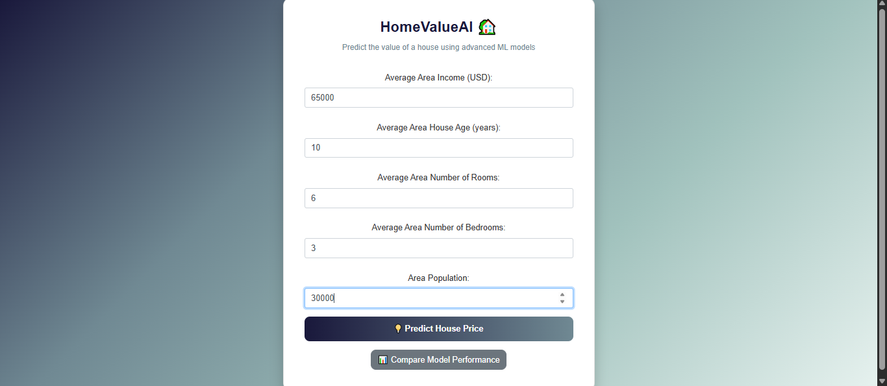
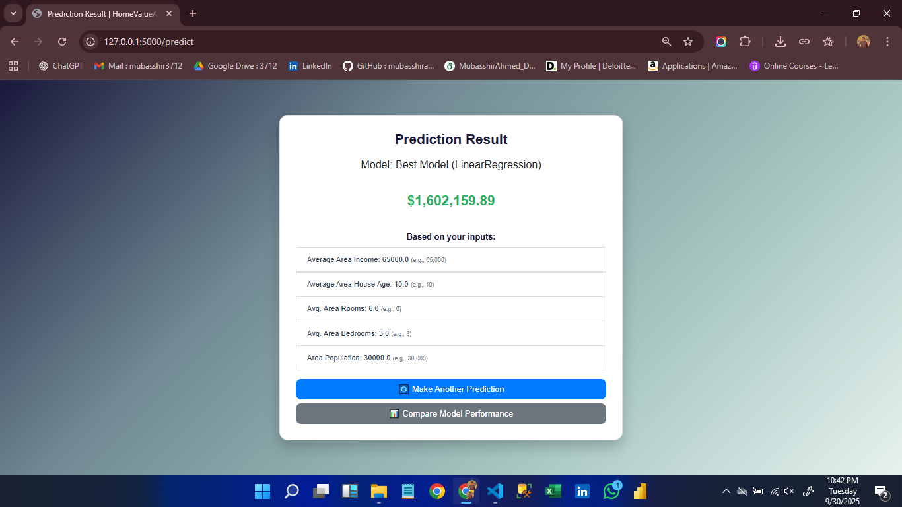
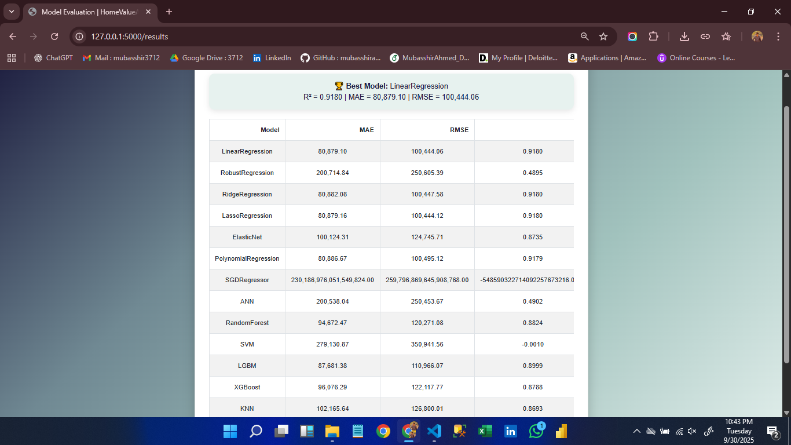

# 🏡 HomeValueAI  
**Intelligent Housing Price Predictor**  

[](https://www.python.org/)  
[](https://flask.palletsprojects.com/)  
[](https://scikit-learn.org/)  
[](https://xgboost.readthedocs.io/)  
[](https://lightgbm.readthedocs.io/)  

---

## 📌 Project Overview  
**HomeValueAI** is an end-to-end **Machine Learning & Flask Web Application** that predicts the price of a house based on key socio-economic and real-estate features.  

It demonstrates the full ML pipeline:  
✅ Exploratory Data Analysis (EDA)  
✅ Multiple Regression Models Training & Comparison  
✅ Model Evaluation & Selection (Linear Regression emerged as best)  
✅ Flask Web Application with premium UI  
✅ Logging of predictions for tracking  

---

## ⚡ Features
- 🏠 Predict house prices using **trained ML models**  
- 📊 Compare performance of multiple algorithms (Linear, Ridge, Lasso, RF, XGBoost, LGBM, etc.)  
- 🎨 Elegant and responsive UI (sage–teal–night gradient)  
- 📝 Prediction logging with timestamp  
- 🚀 Easy to deploy locally  

---

## 🛠️ Tech Stack
- **Frontend:** HTML, CSS, Bootstrap  
- **Backend:** Flask  
- **ML Models:** scikit-learn, XGBoost, LightGBM  
- **Other Tools:** Pandas, Numpy, Matplotlib  

---

## 📂 Project Structure
```
02_HomeValueAI/
├─ app/
│  ├─ models/                  # Trained models (.pkl)
│  ├─ static/                  # Static files (CSS, images)
│  ├─ templates/               # HTML templates
│  └─ app.py                   # Flask backend
├─ data/
│  ├─ predictions_log.csv      # Logs of user predictions
│  └─ USA_Housing.csv          # Dataset
├─ notebook/
│  └─ HomeValueAI.ipynb        # End-to-end notebook (EDA + Training)
└─ results/
   ├─ best_model.txt
   ├─ example_predictions.csv
   ├─ model_evaluation_results.csv
   ├─ UI_Overview.png
   ├─ UI_Overview_predict.png
   └─ UI_Overview_results.png
```

---

## 🚀 Getting Started

### 1️⃣ Clone the repository
```bash
git clone https://github.com/your-username/HomeValueAI.git
cd HomeValueAI/app
```

### 2️⃣ Install dependencies
```bash
pip install -r requirements.txt
```

### 3️⃣ Run the app
```bash
python app.py
```

### 4️⃣ Open in browser  
Visit: **http://127.0.0.1:5000/**  

---

## 🖼️ Screenshots  

### 🔹 Home Page (Input Form)


### 🔹 Prediction Result


### 🔹 Model Evaluation


---

## 📊 Model Performance  
Best model: **Linear Regression**  
- R² ≈ 0.918  
- MAE ≈ 80,879  
- RMSE ≈ 100,444  

Evaluation results are available in [`results/model_evaluation_results.csv`](results/model_evaluation_results.csv).

---

## 🔮 Future Enhancements
- Add deployment on **Render / AWS / Azure**  
- Support multiple datasets  
- Add API endpoint for integration  
- Enable advanced visualizations in the web app  

---

## 👨‍💻 Author
**Mubasshir Ahmed**  
*Full Stack Data Science Learner | AI & ML Enthusiast* 🚀  

[](https://github.com/mubasshirahmed-3712)  
[](https://linkedin.com/in/mubasshir-ahmed3712)  

---

✨ *Crafted with passion for Machine Learning and elegant design.*
